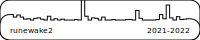

# GitHub Bookmark Generator

Generates a 2D SVG of your github activity over a set period that you can use to create a custom bookmark for.

Intended for use with a cricket cutter OR laser cutter.

You can also extrude this svg to create a 3D printable version.



## Running This:

Get a GitHub Personal Access Token

Run BookmarkGenConsole with the Access Token and Username you want to generate the bookmark for:

```sh
dotnet run -- [TOKEN] [USERNAME]
```

Use `dotnet run -- --help` to get help and learn the other available options.